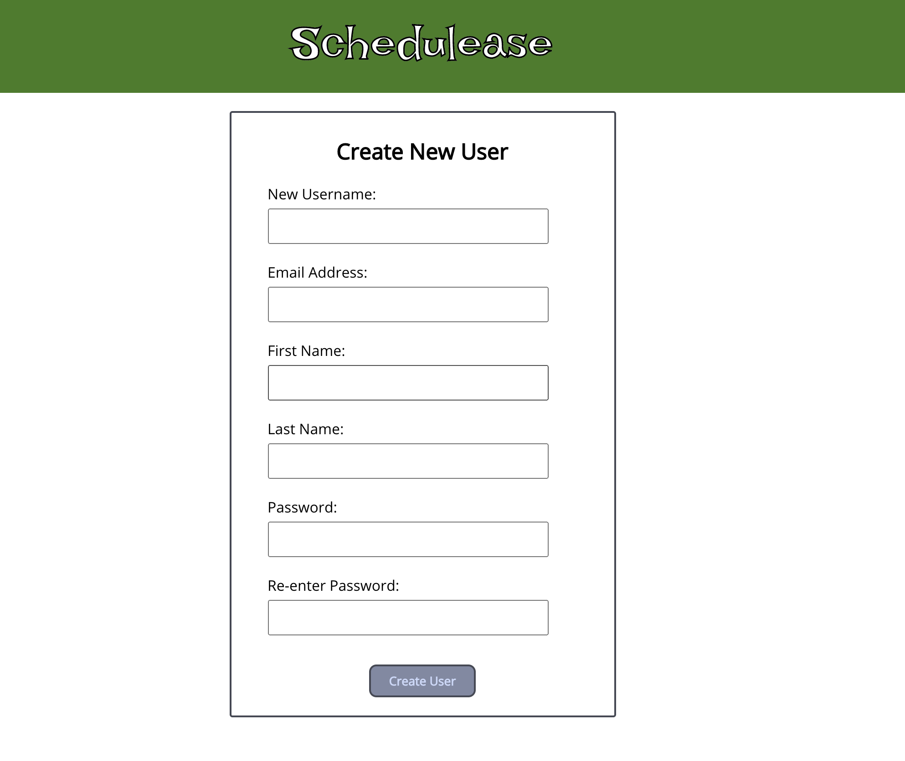
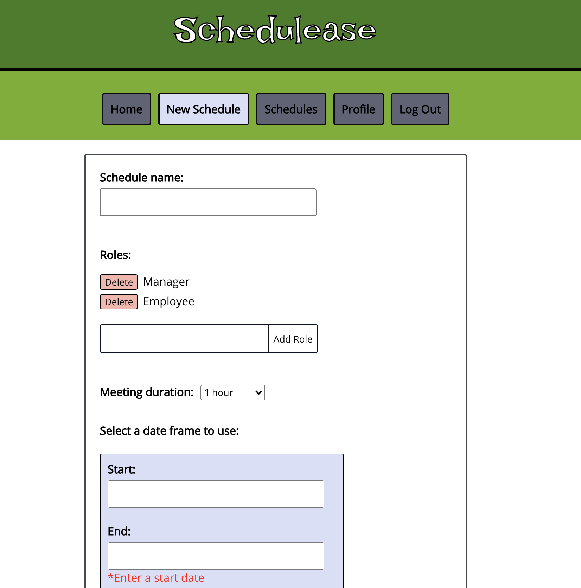
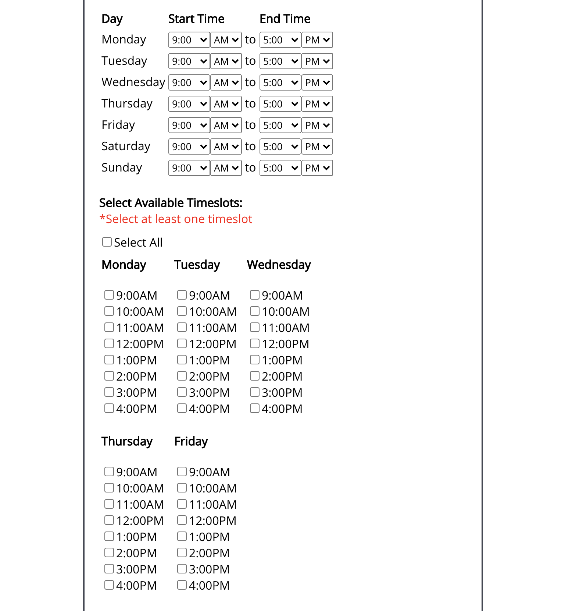
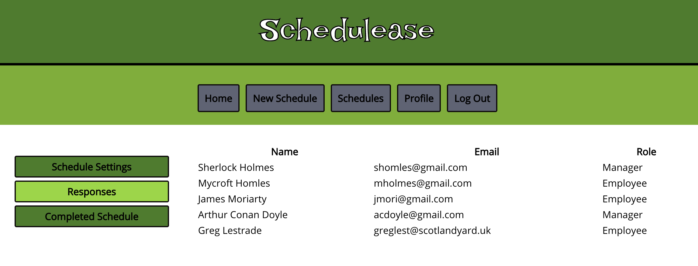
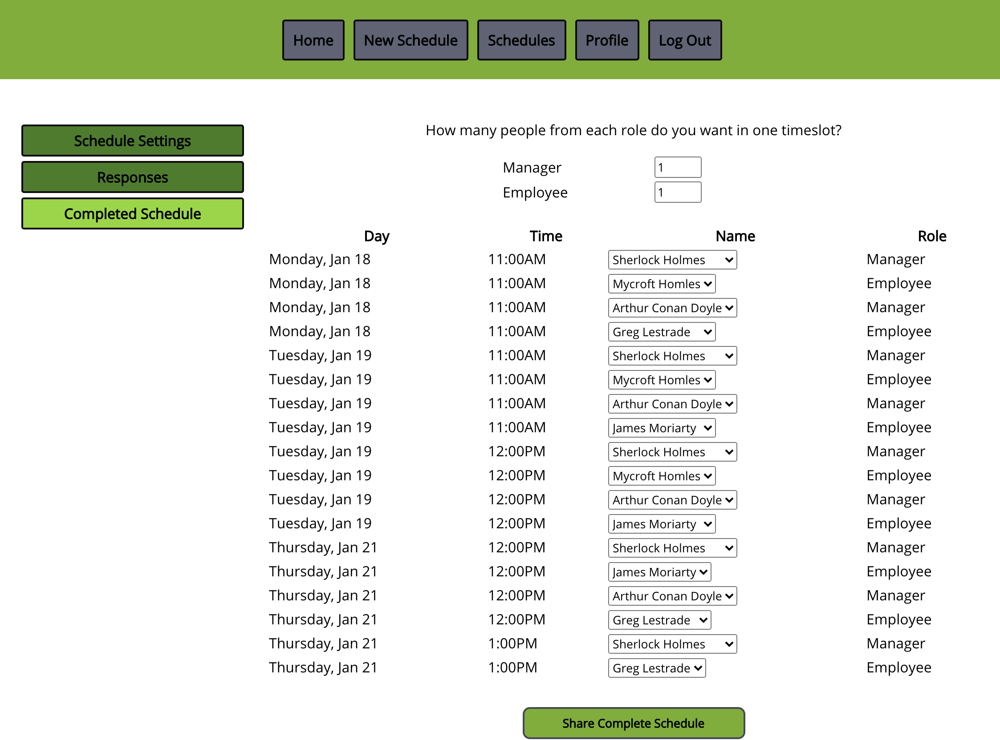

# Schedulease

See live app here: https://schedulease.vercel.app/
See this repo for back-end: 

## Summary

Schedulease is a scheduling app designed to help users collect availability from a group of people, assign roles to each person, and create a final schedule that takes into account availability, the role of each member, and the number of desired people in each timeslot. Once complete, the schedule can be shared with the participants using a link.

## Functions

Create a user account: 

Create a new schedule: 

View Responses: 

Edit and create a finalized schedule for sharing: 

## Tech Used
* HTML
* CSS
* JavaScript
* React
* RESTful API backend

## Author
Lucy Guida: https://github.com/lguida/Portfolio